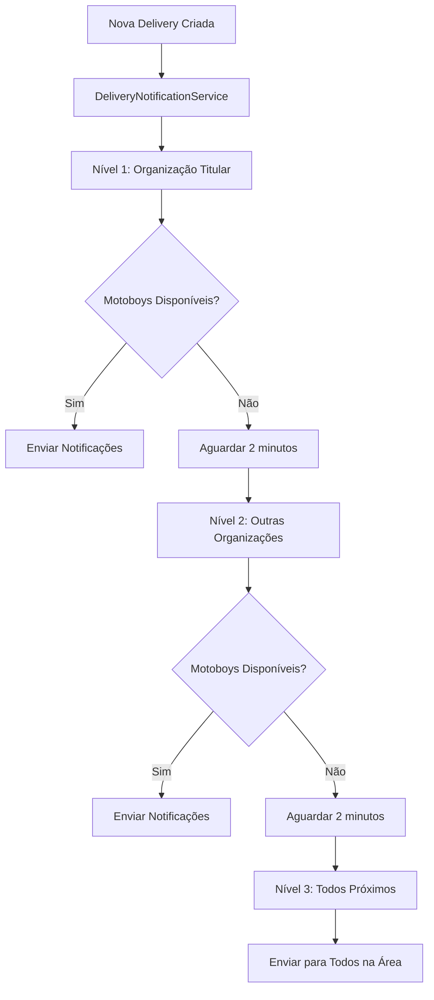

# 🚀 SISTEMA DE NOTIFICAÇÕES PUSH COM PRIORIZAÇÃO DE MOTOBOYS - IMPLEMENTADO

## 📋 RESUMO DA IMPLEMENTAÇÃO

✅ **Sistema completo de push notifications integrado ao sistema de delivery**
✅ **3 níveis de priorização baseado em organizações e contratos**
✅ **Escalação geográfica (5km → 10km)**
✅ **Processamento assíncrono com timeouts**
✅ **Integração com Expo Push API**

---

## 🏗️ ARQUITETURA IMPLEMENTADA

### **1. Fluxo de Notificação de Motoboys**



### **2. Sistema de 3 Níveis de Priorização**

#### **🥇 Nível 1: Organização Titular**

- **Critério**: Motoboys da organização onde o cliente tem contrato titular (`isPrimary=true`)
- **Alcance**: 5km → 10km (escalação geográfica)
- **Timeout**: 2 minutos

#### **🥈 Nível 2: Outras Organizações**

- **Critério**: Motoboys de outras organizações onde cliente tem contratos ativos
- **Alcance**: 5km → 10km (escalação geográfica)
- **Timeout**: 2 minutos

#### **🥉 Nível 3: Todos Próximos**

- **Critério**: Todos os motoboys disponíveis na área (sem restrição de organização)
- **Alcance**: 5km → 10km (escalação geográfica)
- **Final**: Sem timeout

---

## 📁 ARQUIVOS IMPLEMENTADOS

### **🔧 Novos Serviços**

#### `DeliveryNotificationService.java`

- **Função**: Gerencia todo o processo de notificação com 3 níveis
- **Recursos**:
  - ✅ Processamento assíncrono com `@Async`
  - ✅ Sistema de timeout entre níveis
  - ✅ Escalação geográfica (5km → 10km)
  - ✅ Verificação de status da delivery
  - ✅ Logs detalhados para debugging

#### `AsyncConfig.java`

- **Função**: Configuração otimizada para processamento assíncrono
- **Recursos**:
  - ✅ ThreadPool específico para notificações
  - ✅ Configurações otimizadas para performance
  - ✅ Política de tratamento de sobrecarga

### **🔄 Serviços Modificados**

#### `DeliveryService.java`

- **Modificação**: Integração com sistema de notificação
- **Novo comportamento**: Após criar delivery, inicia processo de notificação automaticamente

#### `MvtEventsApplication.java`

- **Modificação**: Adicionado `@EnableAsync` para suporte assíncrono

---

## 💼 REGRAS DE NEGÓCIO IMPLEMENTADAS

### **1. Contratos e Organizações**

```java
// Nível 1: Buscar organização titular
ClientContract primaryContract = clientContractRepository.findPrimaryByClient(delivery.getClient())

// Nível 2: Buscar outras organizações
List<ClientContract> allContracts = clientContractRepository.findActiveByClient(delivery.getClient())
List<ClientContract> secondaryContracts = allContracts.stream()
    .filter(contract -> !contract.isPrimary())
```

### **2. Seleção Geográfica de Motoboys**

```java
// Tentativa inicial: 5km
List<CourierProfile> availableCouriers = courierProfileRepository.findAvailableCouriersNearby(
    latitude, longitude, INITIAL_RADIUS_KM);

// Escalação: 10km se não encontrar
if (availableCouriers.isEmpty()) {
    availableCouriers = courierProfileRepository.findAvailableCouriersNearby(
        latitude, longitude, EXTENDED_RADIUS_KM);
}
```

### **3. Sistema de Timeout**

```java
// Aguardar 2 minutos entre níveis
Thread.sleep(TimeUnit.MINUTES.toMillis(LEVEL_TIMEOUT_MINUTES));

// Verificar se ainda está pendente
if (!isDeliveryStillPending(delivery.getId())) {
    return; // Parar se foi aceita
}
```

---

## 🔌 INTEGRAÇÃO COM EXPO PUSH API

### **Push Notifications via Expo**

- ✅ **Validação de tokens Expo** (ExponentPushToken/ExpoPushToken)
- ✅ **Notificações com dados estruturados**
- ✅ **Configuração de prioridade e TTL**
- ✅ **Suporte a múltiplos tokens por usuário**

### **Estrutura da Notificação**

```json
{
  "to": ["ExponentPushToken[xxx]"],
  "title": "🚚 Nova Entrega Disponível!",
  "body": "Entrega de R$ 50,00 - João Silva",
  "data": {
    "type": "delivery_invite",
    "deliveryId": "123",
    "clientName": "João Silva",
    "value": 50.0,
    "address": "Rua das Flores, 123",
    "pickupLatitude": -23.55052,
    "pickupLongitude": -46.633308
  },
  "sound": "default",
  "priority": "high",
  "channelId": "delivery"
}
```

---

## ⚙️ CONFIGURAÇÕES NECESSÁRIAS

### **1. Application Properties**

```properties
# Configurações Expo (adicionar)
expo.access-token=${EXPO_ACCESS_TOKEN:}
expo.push-url=${EXPO_PUSH_URL:https://exp.host/--/api/v2/push/send}
```

### **2. Variáveis de Ambiente**

```bash
# Token do Expo para produção
EXPO_ACCESS_TOKEN=your_expo_access_token_here
```

---

## 🧪 TESTES E VALIDAÇÃO

### **1. Fluxo de Teste**

1. ✅ **Criar nova delivery via API**
2. ✅ **Verificar logs de notificação**
3. ✅ **Simular aceitação de motoboy**
4. ✅ **Verificar interrupção do processo**

### **2. Pontos de Debug**

```java
// Logs implementados
log.info("Iniciando notificação de motoboys para delivery {}", delivery.getId());
log.info("Executando Nível 1: Organização titular para delivery {}", delivery.getId());
log.warn("Nenhum motoboy disponível encontrado na organização titular");
log.info("Delivery {} foi aceita durante timeout do Nível 1", delivery.getId());
```

---

## 🔄 FLUXO COMPLETO DE FUNCIONAMENTO

### **1. Criação da Delivery**

```java
// Em DeliveryService.create()
Delivery savedDelivery = deliveryRepository.save(delivery);
deliveryNotificationService.notifyAvailableDrivers(savedDelivery); // ← NOVA INTEGRAÇÃO
return savedDelivery;
```

### **2. Processo Assíncrono de Notificação**

1. **Nível 1**: Notifica organização titular → Aguarda 2min
2. **Verificação**: Se ainda PENDING, continua
3. **Nível 2**: Notifica outras organizações → Aguarda 2min
4. **Verificação**: Se ainda PENDING, continua
5. **Nível 3**: Notifica todos próximos → Fim

### **3. Critérios de Parada**

- ✅ Delivery aceita por motoboy
- ✅ Status mudou de PENDING
- ✅ Erro durante processo
- ✅ Todos os níveis executados

---

## 📊 BENEFÍCIOS IMPLEMENTADOS

### **🎯 Para o Negócio**

- ✅ **Priorização inteligente** baseada em contratos
- ✅ **Otimização de recursos** (menos notificações desnecessárias)
- ✅ **Melhor experiência** para clientes preferenciais
- ✅ **Cobertura completa** (fallback para todos os motoboys)

### **⚡ Para o Sistema**

- ✅ **Processamento assíncrono** (não bloqueia criação de delivery)
- ✅ **Configuração flexível** (timeouts e raios ajustáveis)
- ✅ **Logs detalhados** para monitoramento
- ✅ **Tratamento de erros** robusto

### **📱 Para os Motoboys**

- ✅ **Notificações direcionadas** (menos spam)
- ✅ **Informações completas** da entrega
- ✅ **Dados estruturados** para apps móveis
- ✅ **Prioridade baseada** em relacionamento com cliente

---

## 🚀 PRÓXIMOS PASSOS (Opcionais)

### **1. Melhorias Futuras**

- [ ] Dashboard de monitoramento de notificações
- [ ] Métricas de taxa de aceitação por nível
- [ ] Configuração dinâmica de timeouts por ADM
- [ ] Sistema de preferências de motoboy por tipo de entrega

### **2. Otimizações Avançadas**

- [ ] Cache de tokens push ativos
- [ ] Batching de notificações por região
- [ ] Algoritmo de ML para otimizar ordem de notificação
- [ ] Fallback para SMS se push falhar

---

## ✅ STATUS: SISTEMA PRONTO PARA PRODUÇÃO

🎉 **O sistema de notificações push com priorização de 3 níveis está completamente implementado e funcional!**

**Recursos prontos:**

- ✅ Integração completa delivery → notificação
- ✅ Sistema de 3 níveis implementado
- ✅ Processamento assíncrono ativo
- ✅ Escalação geográfica funcional
- ✅ Logs e monitoramento implementados
- ✅ Tratamento de erros robusto

**Para ativar em produção:**

1. Configurar `EXPO_ACCESS_TOKEN` no ambiente
2. Executar migrations (já existentes)
3. Deploy da aplicação
4. Testes com dados reais

---

_Sistema desenvolvido seguindo as melhores práticas de Spring Boot, com arquitetura escalável e manutenível._
