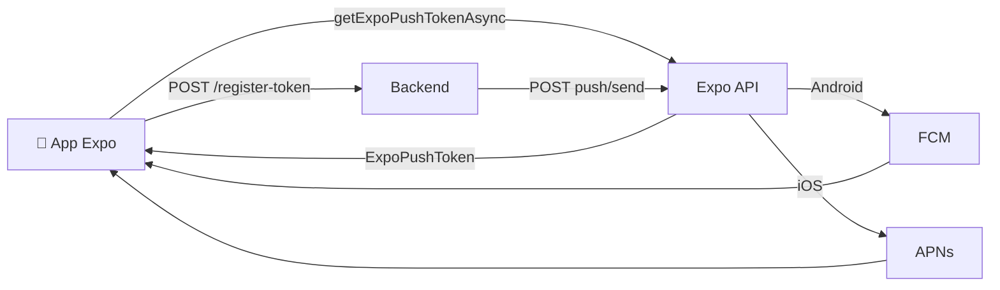

# 🔄 Migração de FCM para Expo Push Tokens

## ❌ Problema Identificado

O backend está implementado para usar **Expo Push Notifications**, mas o mobile está enviando **tokens FCM diretos**.

### Situação Atual (Incompatível)
```javascript
// ❌ Mobile está fazendo isso (FCM direto)
import messaging from '@react-native-firebase/messaging';

const fcmToken = await messaging().getToken();
// Token: "dwgsHTWJTUyC1ew24tIBZh:APA91b..."

await api.post('/api/users/push-token', {
  pushToken: fcmToken,  // ❌ Token FCM não funciona com Expo
  platform: 'android',
  tokenType: 'fcm'
});
```

### Backend Requer
```java
// Backend valida tokens Expo
private boolean isValidExpoToken(String token) {
    return token.startsWith("ExponentPushToken[") || 
           token.startsWith("ExpoPushToken[");
}
```

---

## ✅ Solução: Usar Expo Push Notifications

### Arquitetura Correta


### Passo 1: Instalar Dependências no Mobile
```bash
npx expo install expo-notifications expo-device expo-constants
```

### Passo 2: Implementar Registro de Token Expo
```javascript
import * as Notifications from 'expo-notifications';
import * as Device from 'expo-device';
import Constants from 'expo-constants';

// Configurar comportamento das notificações
Notifications.setNotificationHandler({
  handleNotification: async () => ({
    shouldShowAlert: true,
    shouldPlaySound: true,
    shouldSetBadge: true,
  }),
});

/**
 * Registra token Expo no backend
 */
export async function registerExpoPushToken() {
  try {
    // Verificar se é dispositivo físico
    if (!Device.isDevice) {
      console.warn('Push notifications não funcionam em emuladores');
      return null;
    }

    // Obter permissões
    const { status: existingStatus } = await Notifications.getPermissionsAsync();
    let finalStatus = existingStatus;
    
    if (existingStatus !== 'granted') {
      const { status } = await Notifications.requestPermissionsAsync();
      finalStatus = status;
    }
    
    if (finalStatus !== 'granted') {
      console.warn('Permissão de notificações negada');
      return null;
    }

    // ✅ Obter token EXPO (não FCM!)
    const token = await Notifications.getExpoPushTokenAsync({
      projectId: Constants.expoConfig?.extra?.eas?.projectId, // Do app.json
    });

    console.log('✅ Expo Push Token:', token.data);
    // Token formato: ExpoPushToken[xxxxxxxxxxxxxxxxxxxxxx]

    // Enviar para backend
    await api.post('/api/users/push-token', {
      pushToken: token.data,      // ✅ Token Expo
      platform: Platform.OS,       // 'ios' ou 'android'
      tokenType: 'expo',           // ✅ Tipo Expo (não 'fcm')
    });

    return token.data;

  } catch (error) {
    console.error('❌ Erro ao registrar token Expo:', error);
    return null;
  }
}
```

### Passo 3: Chamar ao Fazer Login
```javascript
// No AuthContext ou após login
useEffect(() => {
  if (user) {
    registerExpoPushToken();
  }
}, [user]);
```

### Passo 4: Listener de Notificações
```javascript
import { useEffect, useRef } from 'react';
import * as Notifications from 'expo-notifications';

export function useNotifications() {
  const notificationListener = useRef();
  const responseListener = useRef();

  useEffect(() => {
    // Listener quando notificação é recebida (app em foreground)
    notificationListener.current = Notifications.addNotificationReceivedListener(notification => {
      console.log('📬 Notificação recebida:', notification);
    });

    // Listener quando usuário toca na notificação
    responseListener.current = Notifications.addNotificationResponseReceivedListener(response => {
      console.log('👆 Notificação tocada:', response);
      
      const data = response.notification.request.content.data;
      
      // Navegar baseado no tipo
      if (data.type === 'NEW_DELIVERY') {
        navigation.navigate('DeliveryDetails', { 
          deliveryId: data.deliveryId 
        });
      }
    });

    return () => {
      Notifications.removeNotificationSubscription(notificationListener.current);
      Notifications.removeNotificationSubscription(responseListener.current);
    };
  }, []);
}
```

---

## 🔧 Configuração app.json

Adicione no `app.json`:

```json
{
  "expo": {
    "name": "Zapi10",
    "slug": "zapi10-app",
    "plugins": [
      [
        "expo-notifications",
        {
          "icon": "./assets/notification-icon.png",
          "color": "#ffffff",
          "sounds": ["./assets/notification-sound.wav"]
        }
      ]
    ],
    "android": {
      "googleServicesFile": "./google-services.json",
      "useNextNotificationsApi": true,
      "adaptiveIcon": {
        "foregroundImage": "./assets/adaptive-icon.png",
        "backgroundColor": "#ffffff"
      }
    },
    "ios": {
      "bundleIdentifier": "com.zapi10.app",
      "buildNumber": "1.0.0"
    },
    "extra": {
      "eas": {
        "projectId": "seu-project-id-aqui"
      }
    }
  }
}
```

---

## 🎯 Backend Já Está Pronto!

O backend já está configurado para Expo:

### ✅ Aceita Tokens Expo
```java
// UserPushTokenService.java - linha 42-46
if ("fcm".equals(deviceTypeValue) || "expo".equals(deviceTypeValue)) {
    deviceTypeValue = "mobile";
}
```

### ✅ Envia via Expo Push API
```java
// PushNotificationService.java
@Value("${expo.push-url:https://exp.host/--/api/v2/push/send}")
private String expoPushUrl;

private boolean isValidExpoToken(String token) {
    return token.startsWith("ExponentPushToken[") || 
           token.startsWith("ExpoPushToken[");
}
```

### ✅ Variáveis de Ambiente (.env)
```bash
# Expo Push Notifications (opcional, mas recomendado para rate limits maiores)
EXPO_ACCESS_TOKEN=seu-expo-access-token
EXPO_PUSH_URL=https://exp.host/--/api/v2/push/send
```

---

## 🔍 Testando

### 1. Verificar Token no Mobile
```javascript
const token = await registerExpoPushToken();
console.log('Token registrado:', token);
// Deve começar com: ExpoPushToken[
```

### 2. Verificar no Backend
```bash
# Ver logs do backend
tail -f app.log | grep "Registrando token push"

# Verificar no banco
psql -h localhost -p 5435 -U mvt -d mvt-events -c \
"SELECT token, platform, device_type FROM user_push_tokens WHERE is_active = true;"
```

### 3. Testar Envio
Use o endpoint de teste do backend:
```bash
curl -X POST http://localhost:8080/api/test/push/send-to-user \
  -H "Content-Type: application/json" \
  -H "Authorization: Bearer SEU_TOKEN" \
  -d '{
    "userId": "6e8104d7-285e-4a80-9f13-857200d27987",
    "title": "Teste",
    "body": "Notificação de teste"
  }'
```

---

## 📝 Checklist de Migração

- [ ] Remover `@react-native-firebase/messaging` do mobile
- [ ] Instalar `expo-notifications`
- [ ] Implementar `registerExpoPushToken()` 
- [ ] Atualizar chamadas de API para enviar tokens Expo
- [ ] Configurar `app.json` com plugin expo-notifications
- [ ] Testar em dispositivo físico (não funciona em emulador)
- [ ] Verificar logs do backend para confirmar tokens Expo

---

## 🚨 Importante

1. **Tokens Expo só funcionam em builds Expo** (não em builds bare React Native)
2. **Não funcionam em emuladores** - precisa dispositivo físico
3. **Formato do token:** `ExpoPushToken[xxxxxxxxxxxxxxxxxxxxxx]`
4. **FCM é gerenciado automaticamente** pelo Expo (não precisa configurar manualmente)

---

## 📚 Referências

- [Expo Push Notifications Docs](https://docs.expo.dev/push-notifications/overview/)
- [Expo Notifications API](https://docs.expo.dev/versions/latest/sdk/notifications/)
- [Expo Push Service](https://expo.dev/notifications)
