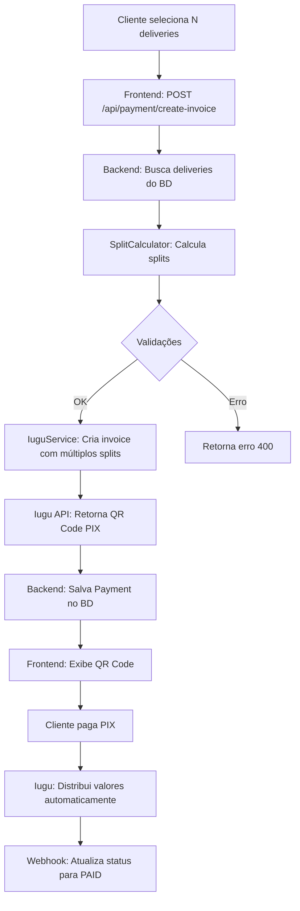

# 💡 Solução: Invoice Consolidada com Múltiplos Splits

**Data**: 04/12/2025  
**Problema**: Cliente paga múltiplas deliveries com motoboys e gerentes diferentes  
**Solução**: Uma única invoice no Iugu com splits consolidados

---

## 🎯 Visão Geral

### Antes (Implementação Original)
```
Cliente seleciona 3 deliveries → 3 invoices separadas no Iugu
```
❌ Complexo para o cliente  
❌ Múltiplas taxas do Iugu  
❌ UX ruim

### Agora (Nova Implementação)
```
Cliente seleciona 3 deliveries → 1 invoice consolidada com múltiplos splits
```
✅ Uma única cobrança PIX  
✅ Uma única taxa do Iugu  
✅ Backend calcula e distribui automaticamente  
✅ UX simples

---

## 📊 Exemplo Prático

### Cenário: Cliente tem 5 deliveries para pagar

```
Delivery #1: R$ 50  - Motoboy A + Gerente X
Delivery #2: R$ 30  - Motoboy B + Gerente X  
Delivery #3: R$ 20  - Motoboy A + Gerente Y
Delivery #4: R$ 40  - Motoboy C + Gerente Y
Delivery #5: R$ 60  - Motoboy A + Gerente Z
────────────────────────────────────────────
TOTAL:      R$ 200
```

### Cálculo dos Splits (87% motoboy / 5% gerente / 8% plataforma)

#### 1️⃣ Por Delivery (cálculo intermediário)

| Delivery | Valor  | Motoboy   | Valor Moto | Gerente   | Valor Ger |
|----------|--------|-----------|------------|-----------|-----------|
| #1       | R$ 50  | Motoboy A | R$ 43,50   | Gerente X | R$ 2,50   |
| #2       | R$ 30  | Motoboy B | R$ 26,10   | Gerente X | R$ 1,50   |
| #3       | R$ 20  | Motoboy A | R$ 17,40   | Gerente Y | R$ 1,00   |
| #4       | R$ 40  | Motoboy C | R$ 34,80   | Gerente Y | R$ 2,00   |
| #5       | R$ 60  | Motoboy A | R$ 52,20   | Gerente Z | R$ 3,00   |

#### 2️⃣ Consolidação (soma por pessoa)

| Pessoa      | Entregas       | Total       |
|-------------|----------------|-------------|
| Motoboy A   | #1, #3, #5     | R$ 113,10   |
| Motoboy B   | #2             | R$ 26,10    |
| Motoboy C   | #4             | R$ 34,80    |
| Gerente X   | #1, #2         | R$ 4,00     |
| Gerente Y   | #3, #4         | R$ 3,00     |
| Gerente Z   | #5             | R$ 3,00     |
| Plataforma  | -              | R$ 16,00    |
| **TOTAL**   | -              | **R$ 200**  |

### 3️⃣ Invoice no Iugu

```json
{
  "email": "cliente@example.com",
  "due_date": "2025-12-05",
  "total_cents": 20000,
  "items": [
    {
      "description": "Pagamento de 5 entregas",
      "quantity": 1,
      "price_cents": 20000
    }
  ],
  "splits": [
    {
      "recipient_account_id": "iugu_account_motoboy_a",
      "cents": 11310,
      "percent": null
    },
    {
      "recipient_account_id": "iugu_account_motoboy_b",
      "cents": 2610,
      "percent": null
    },
    {
      "recipient_account_id": "iugu_account_motoboy_c",
      "cents": 3480,
      "percent": null
    },
    {
      "recipient_account_id": "iugu_account_gerente_x",
      "cents": 400,
      "percent": null
    },
    {
      "recipient_account_id": "iugu_account_gerente_y",
      "cents": 300,
      "percent": null
    },
    {
      "recipient_account_id": "iugu_account_gerente_z",
      "cents": 300,
      "percent": null
    }
  ]
}
```

**Nota**: O Iugu automaticamente credita o resto (R$ 16,00) na conta master da plataforma

---

## 🔧 Implementação

### Novo Endpoint (Simplificado)

```
POST /api/payment/create-invoice
```

### Request

```json
{
  "deliveryIds": [1, 2, 3, 4, 5],
  "clientEmail": "cliente@example.com",
  "expirationHours": 24
}
```

### Response

```json
{
  "paymentId": 123,
  "iuguInvoiceId": "XXXXXXXXXXXXXX",
  "pixQrCode": "00020126360014BR.GOV.BCB.PIX...",
  "pixQrCodeUrl": "https://faturas.iugu.com/qr/xxxxx.png",
  "secureUrl": "https://faturas.iugu.com/xxxxxx",
  "amount": 200.00,
  "deliveryCount": 5,
  "splits": {
    "couriers": 3,
    "managers": 3,
    "courierAmount": 174.00,
    "managerAmount": 10.00,
    "platformAmount": 16.00
  },
  "status": "PENDING",
  "expiresAt": "2025-12-05T19:00:00",
  "statusMessage": "⏳ Aguardando pagamento de 5 entregas..."
}
```

---

## 📝 Classes Criadas

### 1. `CreateInvoiceRequest.java`
```java
@Data
public class CreateInvoiceRequest {
    @NotEmpty
    private List<Long> deliveryIds;
    
    @NotBlank @Email
    private String clientEmail;
    
    @Min(1) @Max(168)
    private Integer expirationHours = 24;
}
```

### 2. `RecipientSplit.java`
```java
@Data
@AllArgsConstructor
public class RecipientSplit {
    private String iuguAccountId;
    private RecipientType type; // COURIER, MANAGER, PLATFORM
    private Integer amountCents;
    
    public enum RecipientType {
        COURIER, MANAGER, PLATFORM
    }
}
```

### 3. `SplitCalculator.java`
```java
@Service
@RequiredArgsConstructor
public class SplitCalculator {
    private final IuguConfig iuguConfig;
    
    /**
     * Calcula splits consolidados para múltiplas deliveries
     */
    public List<RecipientSplit> calculateSplits(List<Delivery> deliveries) {
        // 1. Validar deliveries
        // 2. Para cada delivery, calcular 87% motoboy + 5% gerente
        // 3. Agrupar por pessoa (soma se mesma pessoa)
        // 4. Plataforma recebe o resto
        // 5. Retornar lista de splits para o Iugu
    }
}
```

---

## 🔄 Fluxo Completo



---

## ✅ Vantagens

1. **UX Simples**: Cliente paga uma vez só
2. **Uma Taxa**: Iugu cobra apenas R$ 0,59 (não N × R$ 0,59)
3. **Automático**: Backend calcula tudo
4. **Flexível**: Suporta qualquer combinação de motoboys/gerentes
5. **Transparente**: Logs detalhados de como foi dividido

---

## 🧪 Como Testar

```bash
# 1. Criar deliveries de teste (variando motoboys e gerentes)
curl -X POST "http://localhost:8080/api/deliveries" \
  -H "Authorization: Bearer $TOKEN" \
  -d '{...}'

# 2. Criar invoice consolidada
curl -X POST "http://localhost:8080/api/payment/create-invoice" \
  -H "Content-Type: application/json" \
  -H "Authorization: Bearer $TOKEN" \
  -d '{
    "deliveryIds": [1, 2, 3, 4, 5],
    "clientEmail": "cliente@test.com",
    "expirationHours": 24
  }' | python3 -m json.tool

# 3. Verificar logs do backend
tail -f app-iugu-sandbox.log | grep "Split"

# Deve mostrar algo como:
# 📊 Calculando splits para 5 deliveries
# 💰 Valor total: R$ 200.00
# ✅ Splits calculados:
#    👨‍🚀 3 motoboy(s): R$ 174.00
#    👔 3 gerente(s): R$ 10.00
#    🏢 Plataforma: R$ 16.00
#    💰 TOTAL: R$ 200.00
```

---

## 📚 Próximos Passos

1. ✅ Classes criadas: `CreateInvoiceRequest`, `RecipientSplit`, `SplitCalculator`
2. ⏳ **Pendente**: Atualizar `PaymentController` com novo endpoint
3. ⏳ **Pendente**: Atualizar `IuguService.createInvoiceWithSplit()` para aceitar múltiplos splits
4. ⏳ **Pendente**: Criar testes unitários para `SplitCalculator`
5. ⏳ **Pendente**: Atualizar documentação do IUGU_SANDBOX_ROADMAP.md

---

**Status**: ✅ Classes base implementadas  
**Próximo**: Atualizar controller e service
