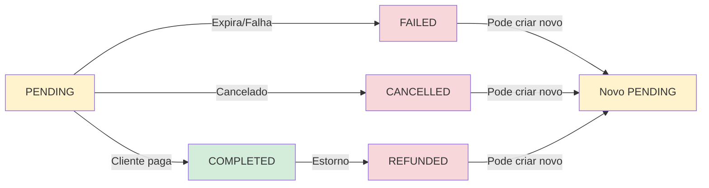

# 🔒 Constraint de Pagamento Ativo Único por Delivery

**Data**: 04/12/2025  
**Migration**: V9__add_active_payment_constraint.sql  
**Tipo**: Database Constraint (Partial Unique Index)

---

## 📋 Objetivo

Garantir que cada **delivery** tenha **no máximo UM pagamento ativo** (status `PENDING` ou `COMPLETED`) ao mesmo tempo, prevenindo:
- ✅ Duplicação de QR Codes PIX para a mesma delivery
- ✅ Cobranças duplicadas
- ✅ Inconsistências no sistema de pagamentos

---

## 🛠️ Implementação

### 1. Função Helper

```sql
CREATE OR REPLACE FUNCTION is_payment_active(payment_id BIGINT) 
RETURNS BOOLEAN AS $$
BEGIN
    RETURN EXISTS (
        SELECT 1 FROM payments 
        WHERE id = payment_id 
        AND status IN ('PENDING', 'COMPLETED')
    );
END;
$$ LANGUAGE plpgsql IMMUTABLE;
```

**O que faz**: Retorna `TRUE` se o pagamento está com status `PENDING` ou `COMPLETED`.

### 2. Índice Único Parcial

```sql
CREATE UNIQUE INDEX idx_unique_active_payment_per_delivery 
ON payment_deliveries (delivery_id)
WHERE is_payment_active(payment_id);
```

**O que faz**: 
- Cria um índice único na coluna `delivery_id`
- **MAS** apenas para linhas onde `is_payment_active(payment_id)` retorna `TRUE`
- Isso significa que a mesma `delivery_id` pode aparecer múltiplas vezes, **desde que** os pagamentos não sejam ativos

---

## ✅ Cenários Permitidos

### Cenário 1: Delivery sem pagamento
```sql
-- ✅ OK - Nenhuma restrição
INSERT INTO payment_deliveries (payment_id, delivery_id) 
VALUES (NULL, 123); -- Não aplicável, mas ilustrativo
```

### Cenário 2: Delivery com um pagamento PENDING
```sql
-- ✅ OK - Primeiro pagamento ativo
INSERT INTO payment_deliveries (payment_id, delivery_id) 
VALUES (1, 123); -- payment 1 status = PENDING
```

### Cenário 3: Delivery com pagamentos FAILED/CANCELLED
```sql
-- ✅ OK - Múltiplos pagamentos inativos são permitidos
INSERT INTO payment_deliveries (payment_id, delivery_id) 
VALUES (10, 123); -- payment 10 status = FAILED

INSERT INTO payment_deliveries (payment_id, delivery_id) 
VALUES (11, 123); -- payment 11 status = CANCELLED

INSERT INTO payment_deliveries (payment_id, delivery_id) 
VALUES (12, 123); -- payment 12 status = REFUNDED
-- Todos OK! Nenhum é PENDING ou COMPLETED
```

### Cenário 4: Payment PENDING → COMPLETED (update)
```sql
-- ✅ OK - Update de status não viola a constraint
UPDATE payments SET status = 'COMPLETED' WHERE id = 1;
-- A constraint continua válida pois ainda é apenas UM pagamento ativo
```

---

## ❌ Cenários BLOQUEADOS

### Cenário 1: Segundo pagamento PENDING
```sql
-- ❌ ERRO - Violação de constraint
INSERT INTO payment_deliveries (payment_id, delivery_id) 
VALUES (1, 123); -- payment 1 status = PENDING (já existe)

INSERT INTO payment_deliveries (payment_id, delivery_id) 
VALUES (2, 123); -- payment 2 status = PENDING
-- ERROR: duplicate key value violates unique constraint 
-- "idx_unique_active_payment_per_delivery"
```

### Cenário 2: Pagamento PENDING + COMPLETED
```sql
-- ❌ ERRO - Violação de constraint
INSERT INTO payment_deliveries (payment_id, delivery_id) 
VALUES (1, 123); -- payment 1 status = PENDING

INSERT INTO payment_deliveries (payment_id, delivery_id) 
VALUES (2, 123); -- payment 2 status = COMPLETED
-- ERROR: duplicate key value violates unique constraint
```

### Cenário 3: Dois pagamentos COMPLETED
```sql
-- ❌ ERRO - Violação de constraint
INSERT INTO payment_deliveries (payment_id, delivery_id) 
VALUES (1, 123); -- payment 1 status = COMPLETED

INSERT INTO payment_deliveries (payment_id, delivery_id) 
VALUES (2, 123); -- payment 2 status = COMPLETED
-- ERROR: duplicate key value violates unique constraint
```

---

## 🔄 Transições de Status Permitidas



---

## 🧪 Testes de Validação

### Teste 1: Criar primeiro pagamento ativo
```sql
-- Setup
INSERT INTO payments (id, status, amount, currency, payer_id, provider, created_at, updated_at) 
VALUES (1, 'PENDING', 50.00, 'BRL', 'uuid-client-1', 'IUGU', NOW(), NOW());

-- Deve funcionar
INSERT INTO payment_deliveries (payment_id, delivery_id) VALUES (1, 123);

-- Verificar
SELECT * FROM payment_deliveries WHERE delivery_id = 123;
-- Resultado: 1 linha
```

### Teste 2: Tentar criar segundo pagamento ativo
```sql
-- Setup
INSERT INTO payments (id, status, amount, currency, payer_id, provider, created_at, updated_at) 
VALUES (2, 'PENDING', 50.00, 'BRL', 'uuid-client-1', 'IUGU', NOW(), NOW());

-- Deve FALHAR
INSERT INTO payment_deliveries (payment_id, delivery_id) VALUES (2, 123);
-- ERROR: duplicate key value violates unique constraint "idx_unique_active_payment_per_delivery"
```

### Teste 3: Criar pagamento inativo após falha
```sql
-- Setup - marcar payment anterior como FAILED
UPDATE payments SET status = 'FAILED' WHERE id = 1;

-- Setup - criar novo payment PENDING
INSERT INTO payments (id, status, amount, currency, payer_id, provider, created_at, updated_at) 
VALUES (3, 'PENDING', 50.00, 'BRL', 'uuid-client-1', 'IUGU', NOW(), NOW());

-- Deve funcionar (payment 1 não é mais ativo)
INSERT INTO payment_deliveries (payment_id, delivery_id) VALUES (3, 123);

-- Verificar
SELECT pd.*, p.status 
FROM payment_deliveries pd 
JOIN payments p ON p.id = pd.payment_id 
WHERE pd.delivery_id = 123;
-- Resultado: 2 linhas (payment 1 = FAILED, payment 3 = PENDING)
```

---

## 🎯 Impacto na Aplicação

### Backend
- ✅ Validação já existe no `PaymentService.validateDeliveriesForPayment()`
- ✅ Constraint no banco é uma **camada extra de segurança**
- ✅ Se a validação do backend falhar, o banco ainda bloqueia
- ⚠️ Erro de constraint retorna código SQL diferente da validação de negócio

### Frontend
- ✅ Nenhuma mudança necessária
- ✅ Backend já retorna mensagens amigáveis antes de tentar inserir
- ✅ Constraint é invisível para o FE (apenas segurança adicional)

---

## 📊 Performance

### Índice Parcial
- ✅ **Mais eficiente** que índice completo
- ✅ Apenas indexa linhas com pagamentos ativos
- ✅ Menos espaço em disco
- ✅ Queries mais rápidas

### Função IMMUTABLE
- ✅ Função marcada como `IMMUTABLE` para melhor performance
- ✅ PostgreSQL pode cachear resultados
- ✅ Permite uso em índices e constraints

---

## 🔧 Rollback

Se necessário, para remover a constraint:

```sql
-- Remover índice
DROP INDEX IF EXISTS idx_unique_active_payment_per_delivery;

-- Remover função
DROP FUNCTION IF EXISTS is_payment_active(BIGINT);
```

---

## 📝 Notas Técnicas

1. **Por que Partial Unique Index?**
   - Constraint CHECK não pode referenciar outras tabelas
   - TRIGGER seria mais lento e complexo
   - Partial Index é simples, rápido e declarativo

2. **Por que função IMMUTABLE?**
   - Permite uso em índices
   - Melhor performance (PostgreSQL pode cachear)
   - Garante que o resultado é sempre o mesmo para os mesmos inputs

3. **Limitações**
   - Se alterar status diretamente no SQL (fora da aplicação), a constraint ainda funciona
   - Função é reavaliada a cada INSERT/UPDATE em `payment_deliveries`
   - Não valida se delivery pode ter pagamento (ex: status PENDING)

---

## ✅ Conclusão

Esta constraint garante **no nível de banco de dados** que não haverá pagamentos ativos duplicados, complementando a validação de negócio já existente no backend.

**Defesa em camadas**:
1. Frontend: UI desabilita ação inválida
2. Backend: Validação de negócio retorna erro amigável
3. Banco de Dados: Constraint bloqueia inserções inválidas

🎯 **Resultado**: Sistema robusto e à prova de erros!
