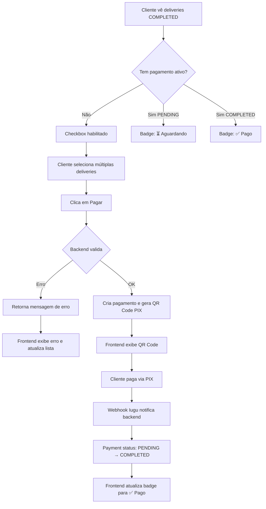

# 💳 Status de Pagamentos Ativos - Documentação para Frontend

**Data**: 04/12/2025  
**Versão**: 1.0  
**Audiência**: Time de Frontend

---

## 📋 Resumo

Este documento define o que é considerado um **pagamento ativo** no sistema Zapi10 e como o frontend deve lidar com essa informação ao exibir deliveries e permitir criação de novos pagamentos.

---

## 🎯 O que é um Pagamento Ativo?

Um **pagamento ativo** é aquele que está em um dos seguintes status:

### ✅ Status Ativos

| Status | Descrição | Ação do Cliente |
|--------|-----------|-----------------|
| `PENDING` | Pagamento criado, aguardando confirmação | Cliente pode pagar via PIX usando o QR Code gerado |
| `COMPLETED` | Pagamento confirmado e recebido | Nenhuma ação necessária, delivery já foi paga |

### ❌ Status NÃO Ativos

| Status | Descrição | Ação do Cliente |
|--------|-----------|-----------------|
| `FAILED` | Pagamento falhou | Cliente pode criar um novo pagamento |
| `CANCELLED` | Pagamento cancelado | Cliente pode criar um novo pagamento |
| `REFUNDED` | Pagamento estornado | Cliente pode criar um novo pagamento |

---

## 🔒 Regras de Negócio

### 1. **Uma Delivery só pode ter UM pagamento ativo**

- ✅ Se status é `PENDING`: delivery aguardando pagamento
- ✅ Se status é `COMPLETED`: delivery já foi paga
- ❌ Não é possível criar novo pagamento se já existe um ativo

### 2. **Constraint no Banco de Dados**

A partir da versão V9 da migration, existe uma constraint que **GARANTE** que cada delivery terá no máximo um pagamento ativo:

```sql
-- Apenas UM pagamento PENDING ou COMPLETED por delivery
CREATE UNIQUE INDEX idx_active_payment_per_delivery 
ON payment_deliveries (delivery_id) 
WHERE EXISTS (
    SELECT 1 FROM payments p 
    WHERE p.id = payment_deliveries.payment_id 
    AND p.status IN ('PENDING', 'COMPLETED')
);
```

⚠️ **Importante**: Se tentar criar um segundo pagamento ativo, o backend retornará erro **antes mesmo** de tentar inserir no banco.

---

## 🖥️ Como o Frontend Deve Lidar

### 1. **Listagem de Deliveries** (`GET /api/deliveries`)

Cada delivery agora retorna um array `payments`:

```json
{
  "id": 123,
  "status": "COMPLETED",
  "totalAmount": 50.00,
  "payments": [
    {
      "id": 456,
      "status": "PENDING"
    }
  ],
  ...
}
```

#### Lógica do Frontend:

```typescript
interface Delivery {
  id: number;
  status: string;
  payments: PaymentSummary[];
  // ... outros campos
}

interface PaymentSummary {
  id: number;
  status: 'PENDING' | 'COMPLETED' | 'FAILED' | 'CANCELLED' | 'REFUNDED';
}

function hasActivePayment(delivery: Delivery): boolean {
  return delivery.payments?.some(p => 
    p.status === 'PENDING' || p.status === 'COMPLETED'
  ) ?? false;
}

function canCreatePayment(delivery: Delivery): boolean {
  // Só pode criar pagamento se:
  // 1. Delivery está COMPLETED
  // 2. NÃO tem pagamento ativo
  return delivery.status === 'COMPLETED' && !hasActivePayment(delivery);
}
```

### 2. **Seleção de Deliveries para Pagamento**

#### Quando mostrar o botão "Pagar Deliveries":

```typescript
function canPayDeliveries(selectedDeliveries: Delivery[]): boolean {
  // Todas devem estar COMPLETED
  const allCompleted = selectedDeliveries.every(d => d.status === 'COMPLETED');
  
  // Nenhuma pode ter pagamento ativo
  const noneHasActivePayment = selectedDeliveries.every(d => !hasActivePayment(d));
  
  return allCompleted && noneHasActivePayment && selectedDeliveries.length > 0;
}
```

#### Feedback Visual:

```tsx
// Exemplo React
function DeliveryRow({ delivery }: { delivery: Delivery }) {
  const activePayment = delivery.payments?.find(p => 
    p.status === 'PENDING' || p.status === 'COMPLETED'
  );

  return (
    <tr>
      <td>{delivery.id}</td>
      <td>{delivery.status}</td>
      <td>
        {activePayment ? (
          <Badge color={activePayment.status === 'COMPLETED' ? 'green' : 'yellow'}>
            {activePayment.status === 'COMPLETED' ? '✅ Pago' : '⏳ Aguardando Pagamento'}
          </Badge>
        ) : (
          <Badge color="gray">Sem pagamento</Badge>
        )}
      </td>
      <td>
        <Checkbox 
          disabled={hasActivePayment(delivery) || delivery.status !== 'COMPLETED'}
          // ... 
        />
      </td>
    </tr>
  );
}
```

### 3. **Criar Novo Pagamento** (`POST /api/payment/create-invoice`)

#### Request:
```json
{
  "deliveryIds": [1, 2, 3],
  "amount": 150.00,
  "clientEmail": "cliente@example.com",
  "motoboyAccountId": "acc_xxx",
  "managerAccountId": "acc_yyy"
}
```

#### Possíveis Respostas de Erro:

##### ❌ Erro 1: Delivery com pagamento ativo
```json
{
  "status": 500,
  "error": "Internal Server Error",
  "message": "❌ Já existe um pagamento PENDENTE (ID: 456) para as entregas: 1, 2, 3. Não é possível criar um novo pagamento para entregas que já possuem pagamento ativo.",
  "timestamp": "2025-12-04T23:45:00"
}
```

**Ação do Frontend**: 
- Mostrar mensagem de erro
- Atualizar lista de deliveries
- Desmarcar deliveries com pagamento ativo

##### ❌ Erro 2: Delivery não está COMPLETED
```json
{
  "status": 500,
  "error": "Internal Server Error",
  "message": "❌ A entrega 1 não está COMPLETED (status atual: IN_TRANSIT). Apenas entregas completadas podem ser pagas.",
  "timestamp": "2025-12-04T23:45:00"
}
```

##### ❌ Erro 3: Deliveries de clientes diferentes
```json
{
  "status": 500,
  "error": "Internal Server Error",
  "message": "❌ A entrega 3 pertence a outro cliente. Todas as entregas devem pertencer ao mesmo cliente.",
  "timestamp": "2025-12-04T23:45:00"
}
```

---

## 🔄 Fluxo Completo



---

## 📊 Exemplos de UI

### Filtro de Deliveries sem Pagamento

```typescript
// No filtro da listagem
const filters = {
  status: 'COMPLETED',
  hasPayment: false, // ← Novo filtro!
  completedAfter: '2025-12-04T00:00:00',
  completedBefore: '2025-12-04T23:59:59'
};
```

### Botão "Pagar Deliveries"

```tsx
<Button 
  disabled={!canPayDeliveries(selectedDeliveries)}
  onClick={handlePaymentCreation}
>
  {selectedDeliveries.length === 0 
    ? 'Selecione deliveries para pagar'
    : `Pagar ${selectedDeliveries.length} entrega(s)`
  }
</Button>

{/* Mensagem de ajuda */}
{selectedDeliveries.some(hasActivePayment) && (
  <Alert type="warning">
    ⚠️ Algumas entregas selecionadas já possuem pagamento ativo.
    Desmarque-as para continuar.
  </Alert>
)}
```

---

## 🧪 Testes Recomendados

### Cenário 1: Delivery sem pagamento
- ✅ Checkbox deve estar habilitado
- ✅ Ao selecionar e pagar, deve criar pagamento com sucesso

### Cenário 2: Delivery com pagamento PENDING
- ✅ Badge deve mostrar "⏳ Aguardando Pagamento"
- ✅ Checkbox deve estar desabilitado
- ✅ Não deve permitir criar novo pagamento

### Cenário 3: Delivery com pagamento COMPLETED
- ✅ Badge deve mostrar "✅ Pago"
- ✅ Checkbox deve estar desabilitado
- ✅ Não deve permitir criar novo pagamento

### Cenário 4: Delivery com pagamento FAILED
- ✅ Deve permitir criar novo pagamento
- ✅ Checkbox deve estar habilitado

### Cenário 5: Tentar pagar deliveries com status misto
- ✅ Backend retorna erro
- ✅ Frontend exibe mensagem clara
- ✅ Atualiza lista de deliveries

---

## 📞 Contato

Dúvidas ou problemas? Fale com o time de backend:
- **Slack**: #backend-zapi10
- **Email**: backend@zapi10.com

---

## 📝 Changelog

### v1.0 - 04/12/2025
- ✅ Definição inicial de pagamentos ativos
- ✅ Constraint no banco de dados (V9)
- ✅ Campo `payments` adicionado ao `DeliveryResponse`
- ✅ Validação de pagamentos duplicados no backend
