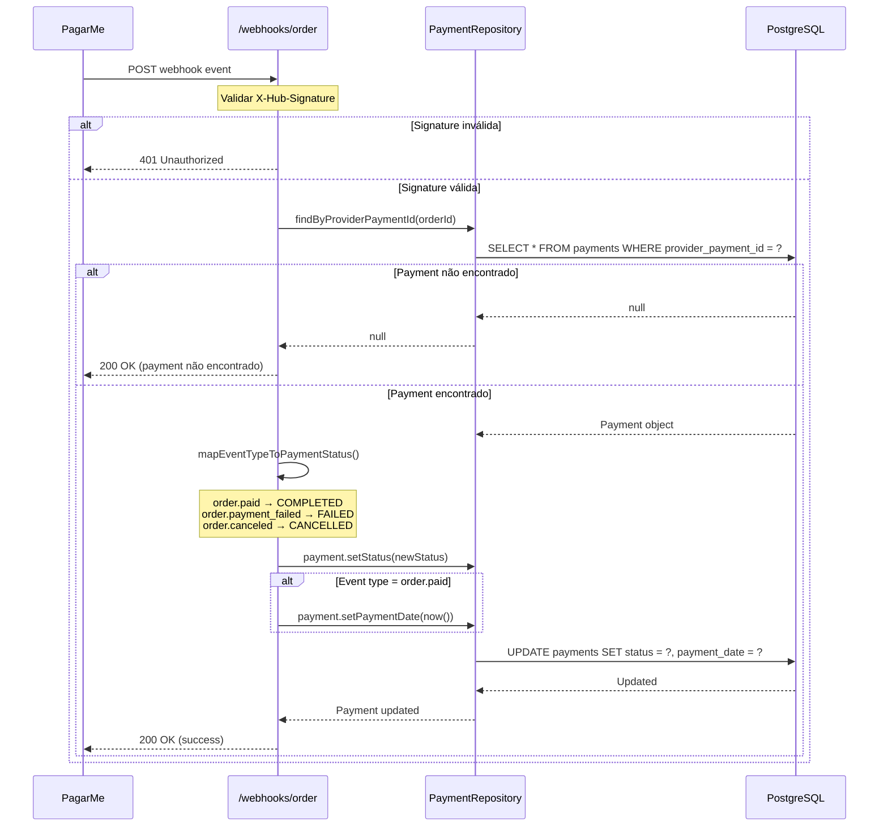

# Webhook de Mudança de Status - Order (Payments)

## 📌 Visão Geral

O sistema possui um webhook endpoint dedicado para receber notificações automáticas do Pagar.me sobre mudanças de status de orders (pagamentos).

**URL do Webhook:** `POST /webhooks/order`

---

## 🔗 Configuração no Pagar.me

### URL para Produção
```
https://seu-dominio.com/webhooks/order
```

### Passos para Configurar no Dashboard Pagar.me

1. Acesse o [Dashboard Pagar.me](https://dashboard.pagar.me/)
2. Vá em **Configurações > Webhooks**
3. Clique em **Adicionar Webhook**
4. Preencha os campos:
   - **URL:** `https://seu-dominio.com/webhooks/order`
   - **Versão:** `1` (ou a versão mais recente)
   - **Eventos:** Selecione os eventos de order:
     - `order.paid` - Pagamento confirmado
     - `order.payment_failed` - Falha no pagamento
     - `order.canceled` - Pedido cancelado
     - `order.pending` - Aguardando pagamento
5. Copie o **Secret** gerado pelo Pagar.me
6. Configure o secret no seu `application.yml`:

```yaml
pagarme:
  webhook:
    secret: "seu_webhook_secret_aqui"
```

---

## 🔐 Segurança

O webhook valida a assinatura HMAC SHA256 enviada pelo Pagar.me no header `X-Hub-Signature`.

### Algoritmo de Validação

1. Pagar.me envia o header: `X-Hub-Signature: sha256=<hash>`
2. Backend recalcula o hash usando HMAC SHA256:
   - **Mensagem:** Payload JSON completo
   - **Chave:** Secret configurado em `application.yml`
3. Compara os hashes
4. Se inválido, retorna HTTP 401

### Exemplo de Validação (Pseudocódigo)

```java
String expectedSignature = "sha256=" + HmacUtils.hmacSha256Hex(secret, payload);
boolean isValid = expectedSignature.equals(receivedSignature);
```

---

## 📨 Payload do Webhook

### Exemplo de Payload - order.paid

```json
{
  "id": "hook_abc123xyz",
  "type": "order.paid",
  "created_at": "2024-01-15T10:30:00Z",
  "data": {
    "id": "or_456def789",
    "code": "ORDER-2024-001",
    "status": "paid",
    "amount": 10000,
    "currency": "BRL",
    "customer": {
      "id": "cus_xyz789",
      "name": "João Silva"
    },
    "items": [
      {
        "description": "Entrega consolidada",
        "quantity": 1,
        "amount": 10000
      }
    ]
  }
}
```

### Exemplo de Payload - order.payment_failed

```json
{
  "id": "hook_fail123",
  "type": "order.payment_failed",
  "created_at": "2024-01-15T10:35:00Z",
  "data": {
    "id": "or_456def789",
    "code": "ORDER-2024-001",
    "status": "failed",
    "amount": 10000,
    "currency": "BRL",
    "payment_method": "pix",
    "failure_reason": "Pagamento expirado"
  }
}
```

---

## 🔄 Eventos Suportados

| Evento Pagar.me          | Novo Status no Sistema | Descrição                         |
|--------------------------|------------------------|-----------------------------------|
| `order.created`          | `PENDING`              | Order criada, aguardando pagamento|
| `order.pending`          | `PENDING`              | Aguardando confirmação            |
| `order.paid`             | `COMPLETED` ✅         | **Pagamento confirmado**          |
| `order.payment_failed`   | `FAILED` ❌            | **Falha no pagamento**            |
| `order.canceled`         | `CANCELLED` 🚫         | **Pedido cancelado**              |

---

## 🎯 Fluxo de Processamento



---

## 📊 Exemplos de Resposta

### ✅ Sucesso - Payment Atualizado

```json
{
  "success": true,
  "message": "Webhook processado com sucesso",
  "paymentId": 42,
  "orderId": "or_456def789",
  "eventType": "order.paid",
  "oldStatus": "PENDING",
  "newStatus": "COMPLETED"
}
```

### ⚠️ Payment Não Encontrado (200 OK)

```json
{
  "success": true,
  "message": "Webhook recebido mas payment não encontrado (pode ser order de teste)",
  "orderId": "or_test_123"
}
```

### ❌ Erro - Signature Inválida

```json
{
  "error": "INVALID_SIGNATURE",
  "message": "Webhook signature inválida"
}
```

### ❌ Erro - Payload Inválido

```json
{
  "error": "INVALID_PAYLOAD",
  "message": "Order ID não encontrado no payload"
}
```

### ❌ Erro - Processamento

```json
{
  "error": "PROCESSING_ERROR",
  "message": "Erro ao processar webhook: NullPointerException"
}
```

---

## 🧪 Testar o Webhook

### 1. Health Check

```bash
curl -X GET https://seu-dominio.com/webhooks/order/health
```

**Resposta:**
```json
{
  "status": "UP",
  "endpoint": "/webhooks/order",
  "message": "✅ Webhook endpoint operacional",
  "info": "Configure esta URL no painel do Pagar.me"
}
```

### 2. Simular Webhook com cURL (Local)

```bash
# Passo 1: Criar o payload
PAYLOAD='{
  "id": "hook_test_123",
  "type": "order.paid",
  "created_at": "2024-01-15T10:30:00Z",
  "data": {
    "id": "or_456def789",
    "code": "TEST-ORDER",
    "status": "paid"
  }
}'

# Passo 2: Gerar assinatura HMAC (usando OpenSSL)
SECRET="seu_webhook_secret"
SIGNATURE=$(echo -n "$PAYLOAD" | openssl dgst -sha256 -hmac "$SECRET" | awk '{print $2}')

# Passo 3: Enviar requisição
curl -X POST http://localhost:8080/webhooks/order \
  -H "Content-Type: application/json" \
  -H "X-Hub-Signature: sha256=$SIGNATURE" \
  -d "$PAYLOAD"
```

### 3. Testar com Pagar.me Test Mode

1. Crie uma order de teste no Dashboard Pagar.me
2. Use a API de teste para disparar eventos:

```bash
curl -X POST https://api.pagar.me/core/v5/webhooks/test \
  -H "Authorization: Bearer sk_test_SEU_TOKEN" \
  -H "Content-Type: application/json" \
  -d '{
    "event_type": "order.paid",
    "webhook_url": "https://seu-dominio.com/webhooks/order"
  }'
```

---

## 🔍 Logs de Debug

O webhook gera logs detalhados para facilitar troubleshooting:

```log
🔔 Webhook recebido em /webhooks/order
📋 Event ID: hook_abc123
📋 Event Type: order.paid
📋 Payload: {"id":"hook_abc123","type":"order.paid",...}
✅ Signature validada com sucesso
💳 Order ID: or_456def789
📊 Order Status: paid
✅ Payment encontrado: ID=42, Status Atual=PENDING
🔄 Mudança de status: PENDING → COMPLETED
💰 Data de pagamento registrada: 2024-01-15T10:30:00
✅ Payment #42 atualizado com sucesso: PENDING → COMPLETED
```

---

## 📝 Checklist de Deploy

- [ ] Configurar secret do webhook em `application.yml`
- [ ] Configurar URL do webhook no Dashboard Pagar.me (`https://seu-dominio.com/webhooks/order`)
- [ ] Selecionar eventos: `order.paid`, `order.payment_failed`, `order.canceled`
- [ ] Testar webhook com payload de teste
- [ ] Validar logs de processamento
- [ ] Verificar atualização de status no banco de dados
- [ ] Testar com order real no ambiente de teste do Pagar.me
- [ ] Monitorar webhooks em produção

---

## 🚨 Troubleshooting

### ❌ Webhook retorna 401 - Signature inválida

**Causa:** Secret configurado no backend não corresponde ao secret do Pagar.me.

**Solução:**
1. Verifique o secret no `application.yml`
2. Compare com o secret mostrado no Dashboard Pagar.me
3. Gere um novo webhook no Pagar.me se necessário

### ❌ Webhook retorna 200 mas payment não é atualizado

**Causa:** Order ID no payload não corresponde ao `provider_payment_id` no banco.

**Solução:**
```sql
-- Verificar se o payment existe
SELECT id, provider_payment_id, status 
FROM payments 
WHERE provider_payment_id = 'or_456def789';
```

### ⚠️ Webhook recebido sem signature (modo development)

**Log:** `⚠️ Webhook recebido SEM signature (modo development?)`

**Causa:** Header `X-Hub-Signature` não foi enviado (comum em testes locais).

**Solução:** O webhook aceita requisições sem signature em desenvolvimento. Em produção, sempre validar signature.

### 🔁 Pagar.me faz múltiplos retries

**Causa:** Webhook não retornou HTTP 200 na primeira tentativa.

**Solução:** Sempre retornar 200 OK, mesmo quando payment não é encontrado (evita retries desnecessários).

---

## 📚 Referências

- [Documentação Oficial Webhooks Pagar.me](https://docs.pagar.me/reference/webhooks)
- [Guia de Segurança HMAC SHA256](https://docs.pagar.me/docs/webhooks-seguranca)
- [Status de Orders](https://docs.pagar.me/reference/status-de-pedido)
- [Testar Webhooks](https://docs.pagar.me/docs/testando-webhooks)

---

## 🎉 Pronto!

O webhook `/webhooks/order` está pronto para uso em produção! 🚀

Configure no Pagar.me e os pagamentos serão atualizados automaticamente. ✨
